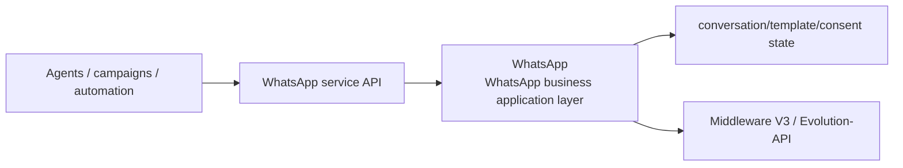
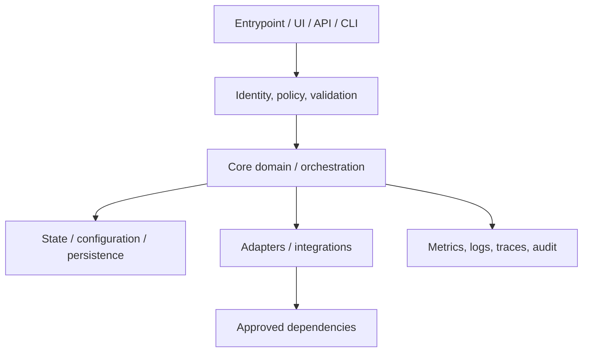
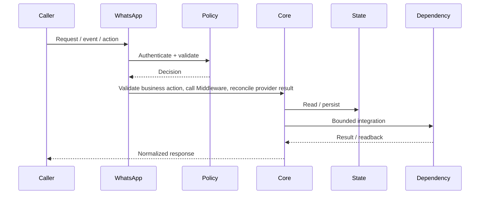
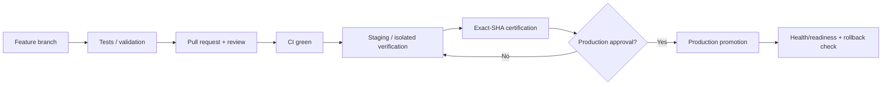
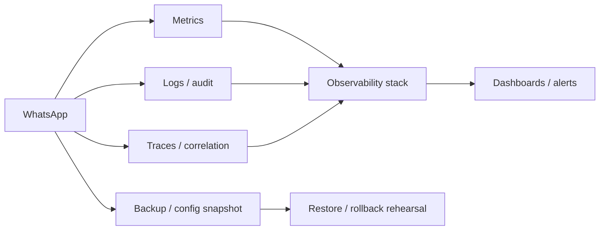

# WhatsApp — Architecture Charts

> Repository: `appolon1908/WhatsApp`  
> Baseline branch: `main`  
> Repository-local visual architecture. Keep these diagrams aligned with code, contracts, data ownership and deployment.

## 1. System context

## 2. Internal component architecture

## 3. Critical flow

## 4. Deployment and promotion

## 5. Observability and recovery

## Ownership notes
- **Role:** WhatsApp business application layer
- **Primary boundary:** WhatsApp service API
- **State/config:** conversation/template/consent state
- **Dependencies/consumers:** Middleware V3 / Evolution-API
- Cross-repository effects must use reviewed contracts; production effects remain separately gated.
